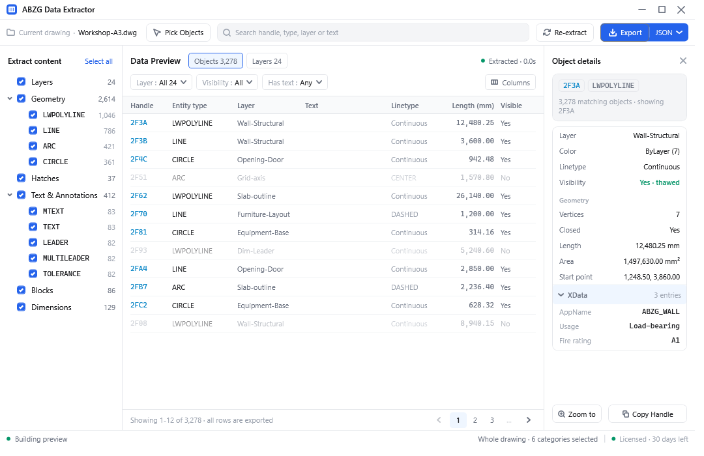
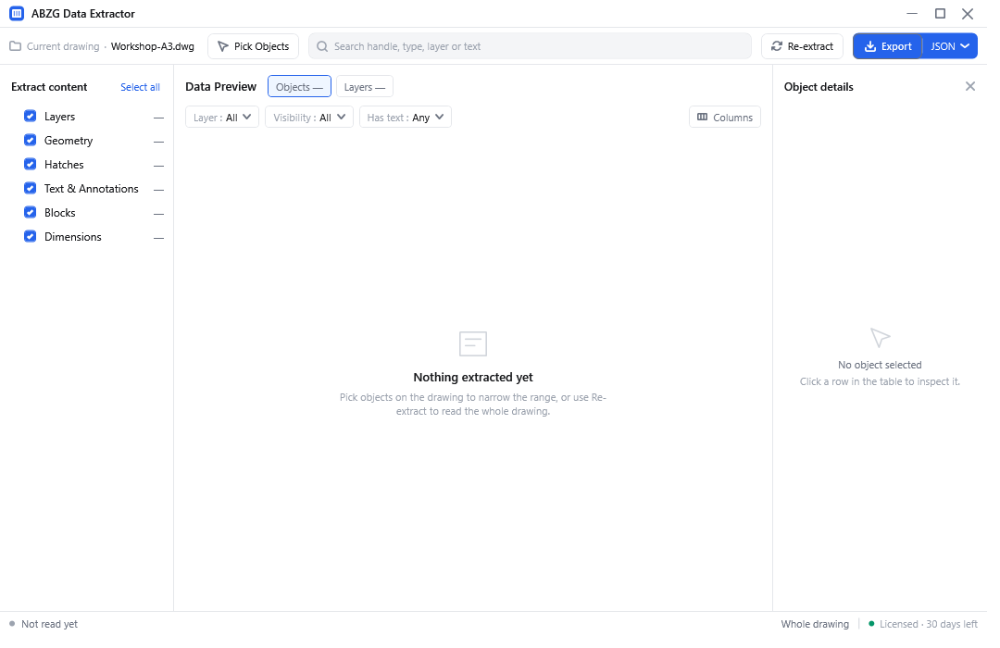
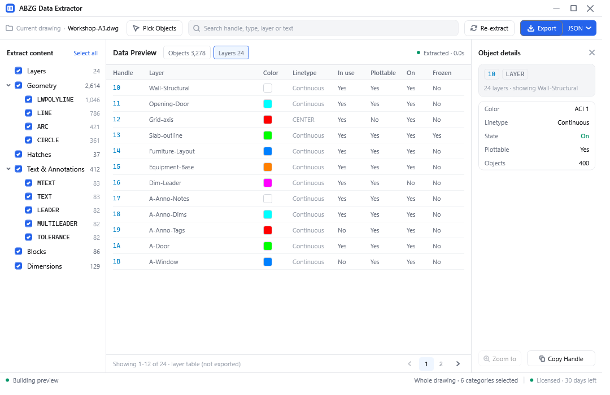
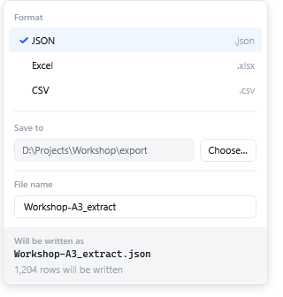

# ABZG CAD Data Extractor — User Guide

For **end users**. This guide is self-contained — development, build and
version-matrix topics are not part of this distribution.

---

## 1. What this is

Extracts **layers, geometry, text, blocks and dimensions** from the current drawing
and exports them to **CSV, Excel (.xlsx) or JSON**.

The UI is a standalone, light-themed window (not a docked side panel). AutoCAD,
BricsCAD and ZWCAD all share the same commands and the same interface.



---

## 2. Supported CAD versions

| CAD | Supported versions | Notes |
|---|---|---|
| **AutoCAD** | **2016 – 2027** (twelve releases) | Requires the full product; **AutoCAD LT is not supported** (it does not expose the .NET API) |
| **BricsCAD** | **V26 / V27** | Requires **Pro or higher**; Lite / Shape do not expose the BRX managed API. **V25 and earlier are not supported** (those are .NET Framework based) |
| **ZWCAD** | **2025 – 2026** | Both releases share one payload. **Start ZWCAD once** before first use so it writes its installation info into the registry (see §4.4) |
| ZWCAD 2021 – 2024 | ⚠️ **not included in this installer** | Installing has no effect and reports no error. See the note below |

> ⚠️ **ZWCAD 2021 – 2024 is not part of this package.** Building that payload needs
> the assemblies from a **ZWCAD 2024** installation, which is not at hand. So on
> ZWCAD 2021 / 2022 / 2023 / 2024 the plugin **will not take effect** after installing
> (harmlessly — it simply does not load; ZWCAD itself is unaffected). If those years
> need to be covered, provide a ZWCAD 2024 install directory to the build side and
> the payload will be added.

**Verified on real machines** (as of 2026-10-02): **AutoCAD 2025 / 2026 / 2027**,
**ZWCAD 2025 / 2026**, **BricsCAD V26** — for these it was confirmed that the payload
installs, the command is recognised, the window opens and data is read out. Every
other version is at the "compiled against that year's real CAD API" level only and
has not been tried yet on a machine with that host.

**A single installer covers all of the above** (except ZWCAD 2021 – 2024, see the
note above). It lays down the payload for every
release / generation — whichever versions you have installed, the matching payload
takes effect automatically and the rest simply sit there; if you install another CAD
later, that payload starts working without reinstalling the plugin.

So it is **normal** to see "12 AutoCAD year payloads" on a machine that only has 2016.
The installer also reports what this machine actually has, under `==> This machine`.

---

## 3. Before you install

### 3.1 System

- 64-bit Windows (all three CAD hosts are 64-bit)
- No administrator rights required — installs per-user by default (`%AppData%` + `HKCU`)

### 3.2 .NET Desktop Runtime (**required for a few releases only**)

| Your release | Extra install needed? |
|---|---|
| AutoCAD 2016 – 2024 | No (the host ships its own .NET Framework) |
| AutoCAD 2025 / 2026 | **.NET 8** |
| AutoCAD 2027 | **.NET 10** |
| **BricsCAD V26 / V27** | **.NET 8** |
| ZWCAD 2025 – 2026 | No |

When it is needed, install **`.NET Desktop Runtime 8.0 (x64)`**:

<https://dotnet.microsoft.com/download/dotnet/8.0>

> **It is the "Desktop Runtime", not the ".NET Runtime".**
> This plugin's UI is WPF. Without `Microsoft.WindowsDesktop.App` the plugin
> **fails to load and reports nothing at all** — it just looks like "the command
> does nothing", which is easily mistaken for a broken plugin.
> We hit exactly this on a real machine.

**You do not have to check this yourself** — the installer detects it and tells you
(see the next section).

---

## 4. Installing

### 4.1 Double-click install (recommended)

Get `ABZG-CadExtractor-Setup-1.0.0.exe` and double-click it. It will:

1. Report the machine's environment (`==> This machine`) — which CADs are installed,
   whether .NET 8 is missing;
2. Lay down the plugin payload for all three platforms;
3. Write the ZWCAD registry registration;
4. Register an uninstall entry under "Settings → Apps".

At the end it waits for a keypress so you can read the result.

**Close any running CAD first** — files that are in use cannot be overwritten.

### 4.2 What the installer prints

Before changing anything, you can look at the output that **changes nothing** (`--list`):

```
==============================================================
 ABZG CAD Data Extractor 1.0.0
==============================================================
Payload : 51 files, 3.35 MB (12 AutoCAD years, 2026 ZWCAD, BricsCAD BRX 26/27)
Scope   : current user (AppData + HKCU)

==> This machine
    .NET Desktop Runtime 8.0 : 8.0.17  (Microsoft.WindowsDesktop.App)
    AutoCAD                  : 2016
    BricsCAD                 : not found
    ZWCAD                    : 2026

    This machine has fewer CAD versions than the payload covers, and that is on
    purpose: every version is laid down, and the matching one starts loading by
    itself as soon as that host is installed. Nothing is skipped for being absent.

==> AutoCAD
      bundle  -> C:\Users\<you>\AppData\Roaming\Autodesk\ApplicationPlugins\ABZG.CadExtractor.bundle
      years   -> 2016, 2017, 2018, 2019, 2020, 2021, 2022, 2023, 2024, 2025, 2026, 2027

==> BricsCAD
      bundle  -> C:\Users\<you>\AppData\Roaming\Bricsys\ApplicationPlugins\ABZG.CadExtractor.BricsCAD.bundle
      series  -> 26, 27

==> ZWCAD
      payload -> C:\Users\<you>\AppData\Local\ABZG\CadExtractor\ZWCAD\<year>
      hive    -> HKCU

==> Report
    Nothing was changed (--list).
```

On a real install, each platform section additionally reports how many files it just
laid down, and `==> Report` becomes:

```
==> Report
    AutoCAD  payload : installed
    BricsCAD payload : installed
    ZWCAD            : 1 registered, 0 copied without registry, 0 skipped
    Warnings : 0

    Done.
```

The word `payload` is deliberate: `installed` means the **plugin** is in place,
not that the CAD is installed — whether the host exists is what the
`This machine` section above is about.

The four lines under `==> This machine` are the **local probe results**: which AutoCAD
years are present, which BricsCAD generation, whether ZWCAD can be registered, and
whether `.NET Desktop Runtime 8.0` is there.

> These lines only report "what this machine has"; they **do not affect what gets
> installed** — see the last paragraph of §2. `not found` does not mean it cannot be
> installed, only that that host is not on this machine right now.

Installer exit codes: `0` everything in place; `1` failure; `2` installed but some
target was skipped (see the report).

### 4.3 Command line (bulk deployment / silent install)

```powershell
ABZG-CadExtractor-Setup-1.0.0.exe --list        # show what would be installed; change nothing
ABZG-CadExtractor-Setup-1.0.0.exe               # install for the current user (no admin needed)
ABZG-CadExtractor-Setup-1.0.0.exe --all-users   # install for all users (ProgramData + HKLM; admin needed)
ABZG-CadExtractor-Setup-1.0.0.exe --uninstall   # uninstall
ABZG-CadExtractor-Setup-1.0.0.exe --quiet       # errors and warnings only (for scripts)
```

All options:

| Option | Effect |
|---|---|
| (none) | Install for the current user; no administrator rights needed |
| `--list` | Show what would be installed, then exit |
| `--uninstall` | Remove files and registry registrations (both scopes) |
| `--self-test` | Verify the embedded payload without unpacking it |
| `--all-users` | Install for all users (`ProgramData` + `HKLM`; admin needed) |
| `--release <year>` | Register only the given ZWCAD year (e.g. `--release 2026`) |
| `--no-registry` | Lay down files only; do not touch the registry |
| `--force` | Continue even while a CAD is running |
| `--target <dir>` | Install into the given directory instead of `AppData` (for testing) |
| `--quiet`, `-q` | Errors and warnings only |
| `--no-pause` | Do not wait for a keypress at the end |
| `-h`, `--help` | Show help |

### 4.4 ZWCAD not recognised? Start it once

Registering the ZWCAD plugin **requires knowing which ZWCAD generation is installed**,
and ZWCAD writes its installation info into the registry **only on first launch**.
So on a machine that has ZWCAD installed but never started, the installer reports:

```
[!] no ZWCAD installation found (looked in HKCU and HKLM under Software\ZWSOFT)
```

**What to do**: start ZWCAD once (open and close it) → run the installer again.
If this machine is not meant to run ZWCAD at all, ignore the warning; the other two
platforms are unaffected.

### 4.5 Uninstalling

Three ways, all equivalent:

- Find **ABZG CAD Data Extractor** in the Start menu / "Settings → Apps" and uninstall it;
- Run the installer itself: `ABZG-CadExtractor-Setup-1.0.0.exe --uninstall`;
- Run the uninstall entry from the command line (the installer prints its path).

Uninstalling removes the plugin files for all three platforms plus the ZWCAD registry
registration. **Your drawings are not affected.**

---

## 5. Using it

### 5.1 Opening the window

Type this in the CAD command line:

| Command | Effect |
|---|---|
| **`ABZGEXTRACT`** | **Opens the extraction window. This is the only one you need day to day** |
| `ABZGEXTRACTTOGGLE` | Show ⇄ collapse (handy for a shortcut key, e.g. `Ctrl+E` in the CUI) |
| `ABZGEXTRACTCLOSE` | Collapse the window |
| `ABZGEXTRACTPICK` | Internal command (called by the panel itself; not typed by hand) |

> **Closing the window = collapsing it**, not destroying it. Checkbox state and any
> data already read are kept. It is really closed when the CAD exits — its lifetime
> follows the CAD session.

### 5.2 The interface



| Area | Contents |
|---|---|
| **Left** Extract content | Which categories to extract. `Geometry` / `Text & Annotations` expand to show sub-items |
| **Middle** Data Preview | Table preview, with `Objects` and `Layers` views (the tab switcher appears only when `Layers` is checked) |
| **Right** Object details | Full fields of the selected row, including block attribute tag / value and XData |
| **Top bar** | Current drawing name, `Pick Objects` (pick in the drawing), search box, `Re-extract`, `Export` |
| **Status bar** | What was read this time, whole drawing vs selection, and licence days remaining |



A few things worth knowing:

- **Opening does not read the drawing.** Opening the window only reads drawing
  information; the left column shows `—` for counts. The actual scan happens when you
  press **`Re-extract`** (whole drawing) or **`Pick Objects`** (only the selected objects).
- **The middle column follows the left column.** Its contents = the categories checked
  on the left ∩ the filter in the top bar — so "what you see in the middle" is exactly
  "what gets written on export".
- **Anything the search box can find has a column in the table** (toggle columns under `▦ Columns`).

### 5.3 Export

Click **`Export`** in the top-right corner; in the menu that opens, pick a format, a
folder and a file name, then press `Export` to write the file.



| Format | Extension | Character |
|---|---|---|
| **JSON** | `.json` | Types are preserved (numbers stay numbers, booleans stay booleans); good for feeding another program |
| **Excel** | `.xlsx` | Numeric values are real number cells, ready to use as a table; one sheet is capped at 1,048,575 rows |
| **CSV** | `.csv` | Plain text, comma-separated; written with a UTF-8 BOM so Excel reads Chinese correctly |

**All three formats write the same data** — the same rows and the same column
definitions. Pick according to what you will do with the file next.

The export range is **what is currently in the middle column** (i.e. left-column
selection ∩ filter).

Exported columns (all formats share one column definition, so fields always match):

```
Handle, Entity type, Category, Layer, Color, Linetype, Length, Area,
Visible, Closed, Vertices, Start X, Start Y, Text, Block, Attributes,
Dimension type
```

Additional fields (XData, block attributes) are then **appended dynamically** based on
the data — up to 12 columns. Different drawings have different extra fields, so the
column set is not fixed.

---

## 6. Troubleshooting

**Q: The plugin is installed, but typing `ABZGEXTRACT` in CAD does nothing (unknown command).**

Check in this order:

1. **Is the version supported**: check the host version under `Help → About` against §2
   (AutoCAD must be the full product, not LT; BricsCAD must be Pro or higher, V26/V27).
2. **Is the runtime there**: with AutoCAD 2025+ or BricsCAD V26+, run
   `dotnet --list-runtimes` and make sure there is a
   **`Microsoft.WindowsDesktop.App 8.0.x`** entry (`Microsoft.NETCore.App` alone is
   not enough — the UI is WPF).
3. **Are the files there**: check that these locations contain the corresponding
   directories.
   - AutoCAD: `%AppData%\Autodesk\ApplicationPlugins\ABZG.CadExtractor.bundle\`
   - BricsCAD: `%AppData%\Bricsys\ApplicationPlugins\ABZG.CadExtractor.BricsCAD.bundle\`
     (note there is **no product-name sub-directory** here — one extra level means it
     is not found, silently)
   - ZWCAD: `%LocalAppData%\ABZG\CadExtractor\ZWCAD\<year>\`
4. **Try loading it by hand**: use `APPLOAD` in AutoCAD, `APPLOAD` or `NETLOAD` in
   BricsCAD, and pick the matching main assembly.
   - AutoCAD: `Contents\Windows\<year>\ABZG.CadExtractor.AutoCAD.dll`
   - BricsCAD: `ABZG.CadExtractor.BricsCAD.dll` inside `Contents\Windows\26\` or `\27\`
     (**pick the one matching your host**)
   - `ABZG.CadExtractor.Core.dll` / `...UI.dll` in the same folder are dependency
     libraries — **do not load them**; neither load `BrxMgd.dll` / `AcMgd.dll`,
     which are the CAD's own API assemblies.

**Q: The command works, but the panel will not open / opens empty.**

The panel does not read the drawing when it opens, which is normal (see §5.2).
Press `Re-extract`. If not even a window frame appears, it is most likely the missing
WPF runtime — back to item 2.

**Q: The status bar says the licence has expired / the whole panel turns into a notice.**

This build carries an **expiry date compiled into the program**; after it passes, the
whole panel is unavailable (not just export). The panel states how to recover
(usually: **set the system clock back**). Because "turning the clock back to extend
the trial" is guarded by a recorded high-water mark, **moving the clock backwards is
detected**.

**Q: The installer says `no ZWCAD installation found`.**

See §4.4.

**Q: I have AutoCAD 2016 only — why lay down 12 years?**

See the last paragraph of §2. It is deliberate: whichever year you run takes effect,
and the others cost nothing at runtime.

---

## Appendix: where the plugin lives

| Platform | Location |
|---|---|
| AutoCAD | `%AppData%\Autodesk\ApplicationPlugins\ABZG.CadExtractor.bundle\` |
| BricsCAD | `%AppData%\Bricsys\ApplicationPlugins\ABZG.CadExtractor.BricsCAD.bundle\` |
| ZWCAD | `%LocalAppData%\ABZG\CadExtractor\ZWCAD\<year>\` + registry registration |

When installed with `--all-users`, the first two land under `%ProgramData%` instead.
